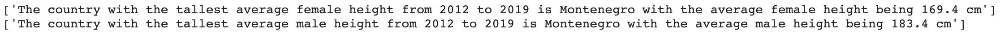
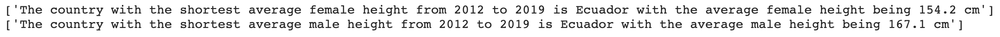

# Converting, Combining, and Visualizing Data

### Converting a Dictionary to a Data Frame
Here is a dictionary I created with different country's average male and female height data from 2014-2019.


```python
heights = {
    'sex':['male', 'male', 'male', 'male', 'male', 'male', 'male', 'male', 'female', 'female', 'female', 'female', 'female', 'female', 'female', 'female'],
    'country':['Italy', 'Romania', 'Montenegro', 'Kenya', 'Dominican Republic', 'Ecuador', 'Ireland', 'Mexico', 'Italy', 'Romania', 'Montenegro', 'Kenya', 'Dominican Republic', 'Ecuador', 'Ireland', 'Mexico'],
    'height':[177.8, 178, 183.4, 169.6, 172.7, 167.1, 179, 172, 164.6, 157, 169.4, 158.2, 159, 154.2, 165, 159]}

print(heights)
```

    {'sex': ['male', 'male', 'male', 'male', 'male', 'male', 'male', 'male', 'female', 'female', 'female', 'female', 'female', 'female', 'female', 'female'], 'country': ['Italy', 'Romania', 'Montenegro', 'Kenya', 'Dominican Republic', 'Ecuador', 'Ireland', 'Mexico', 'Italy', 'Romania', 'Montenegro', 'Kenya', 'Dominican Republic', 'Ecuador', 'Ireland', 'Mexico'], 'height': [177.8, 178, 183.4, 169.6, 172.7, 167.1, 179, 172, 164.6, 157, 169.4, 158.2, 159, 154.2, 165, 159]}


As you can see, this does not convey my data in a readable way. To make this look better, I converted it to a Data Frame, set the index as Country, and pivoted the table to make the columns Sex and the values Height.


```python
import pandas as pd

world_heights = pd.DataFrame(heights)
world_heights.index = world_heights['country'] ; del world_heights['country']
world_heights = world_heights.pivot(columns='sex', values='height')
print(world_heights)
```

    sex                 female   male
    country                          
    Dominican Republic   159.0  172.7
    Ecuador              154.2  167.1
    Ireland              165.0  179.0
    Italy                164.6  177.8
    Kenya                158.2  169.6
    Mexico               159.0  172.0
    Montenegro           169.4  183.4
    Romania              157.0  178.0


Now this is much more readable and I can more easily find the values I want.

### Visualizing World Height Data
After creating an organized and readable Data Frame, I can visualize the data from the table in a bar chart using the following code...


```python
import matplotlib.pyplot as plt

heights.plot(kind='bar', color=['teal','salmon'])
plt.ylabel('height (cm)')
plt.title('Average Height of Males and Females 2014-2019')

plt.show()
```


This bar plot helps visualize the World Height data and we can now start to analyze it.

### Combining and Visualizing Two Data Frames
Some data may need to be appended as time goes on and more research is done. Below, there is a new Data Frame, world_heights2 containing height data from 2012, that I would like to add to my original World Heights Data Frame. 


To combine these Data Frames, I used pd.concat() with the axis=0 option to stack the two datasets...


```python
combined_heights = pd.concat([world_heights, world_heights2], axis=0)
print(combined_heights)
```


Now I have more data that I can visualize again using a bar chart...


```python
combined_heights.plot(kind='bar', color=['purple','pink'])

plt.ylabel('height (cm)')
plt.title('Average Height of Males and Females 2012-2019')

plt.show()
```


### Making Min and Max Statements
The last thing I wanted to do with my Combined Heights Data Frame is make statements about which countries had the shortest and tallest people. To do this, I used the following code...


```python
tall_female = combined_heights['female'].max()
tall_female_country = combined_heights[combined_heights['female'] == tall_female].index.values

tall_male = combined_heights['male'].max()
tall_male_country = combined_heights[combined_heights['male'] == tall_male].index.values

print('The country with the tallest average female height from 2012 to 2019 is ' + tall_female_country + ' with the average female height being ' + str(tall_female) + ' cm')
print('The country with the tallest average male height from 2012 to 2019 is ' + tall_male_country + ' with the average male height being ' + str(tall_mall + ' cm')
```




```python
short_female = combined_heights['female'].min()
short_female_country = combined_heights[combined_heights['female'] == short_female].index.values

short_male = combined_heights['male'].min()
short_male_country = combined_heights[combined_heights['male'] == short_male].index.values

print('The country with the shortest average female height from 2012 to 2019 is ' + short_female_country + ' with the average female height being ' + str(short_female) + ' cm')
print('The country with the shortest average male height from 2012 to 2019 is ' + short_male_country + ' with the average male height being ' + str(short_male) + ' cm')
```



This code is especially useful for my data because even if I decide to update by Data Frame at some point, I will not need to change the code to get the tallest and shortest heights and countries.
