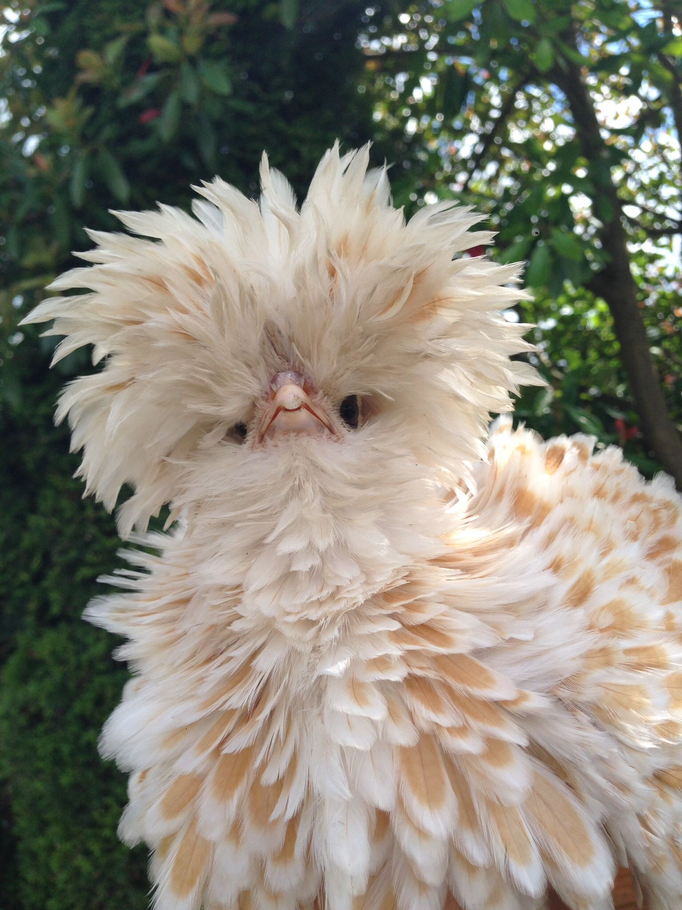

### Aligning Photos using Markdown
When completing a course assignment, I came across the problem of aligning photos using Markdown. I wanted my photo on the right side but the default alignment is left...


```

```


<p>&nbsp;</p>

The **align** parameter can change the alignment of the photo to the right...


```

```


<p>&nbsp;</p>
<p>&nbsp;</p>
<p>&nbsp;</p>
<p>&nbsp;</p>
<p>&nbsp;</p>
<p>&nbsp;</p>
<p>&nbsp;</p>
<p>&nbsp;</p>

This was what I was initially trying to do, but I decided to experiment with a center alignment...


```

```


<p>&nbsp;</p>

I was shocked it did not work! In order to center align a photo you must ***wrap*** the code with the center alignment, like this...


```
<p align='center'>
    
</p>
```

<p align='center'>
    
</p>

<p>&nbsp;</p>

I hope this helped if you were unsure how to align photos in Markdown!
