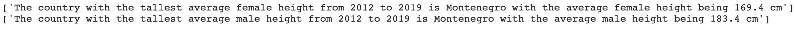
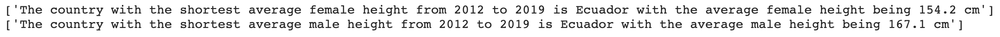

### Making Min and Max Statements
The last thing I wanted to do with my Combined Heights Data Frame is make statements about which countries had the shortest and tallest people. To do this, I used the following code...


```
tall_female = combined_heights['female'].max()
tall_female_country = combined_heights[combined_heights['female'] == tall_female].index.values

tall_male = combined_heights['male'].max()
tall_male_country = combined_heights[combined_heights['male'] == tall_male].index.values

print('The country with the tallest average female height from 2012 to 2019 is ' + tall_female_country + ' with the average female height being ' + str(tall_female) + ' cm')
print('The country with the tallest average male height from 2012 to 2019 is ' + tall_male_country + ' with the average male height being ' + str(tall_mall + ' cm')
```




```
short_female = combined_heights['female'].min()
short_female_country = combined_heights[combined_heights['female'] == short_female].index.values

short_male = combined_heights['male'].min()
short_male_country = combined_heights[combined_heights['male'] == short_male].index.values

print('The country with the shortest average female height from 2012 to 2019 is ' + short_female_country + ' with the average female height being ' + str(short_female) + ' cm')
print('The country with the shortest average male height from 2012 to 2019 is ' + short_male_country + ' with the average male height being ' + str(short_male) + ' cm')
```



This code is especially useful for my data because even if I decide to update my Data Frame at some point, I will not need to change the code to get the tallest and shortest heights and countries.
