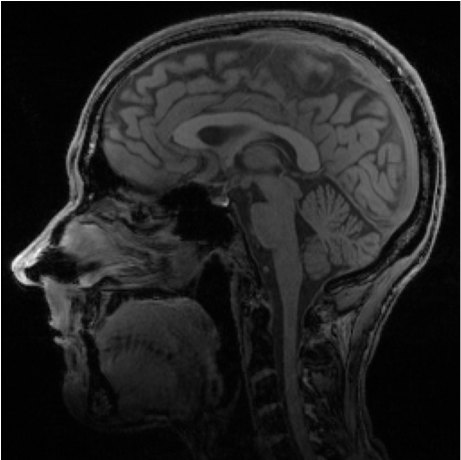
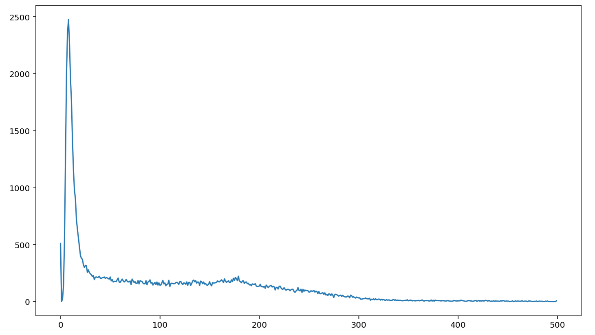
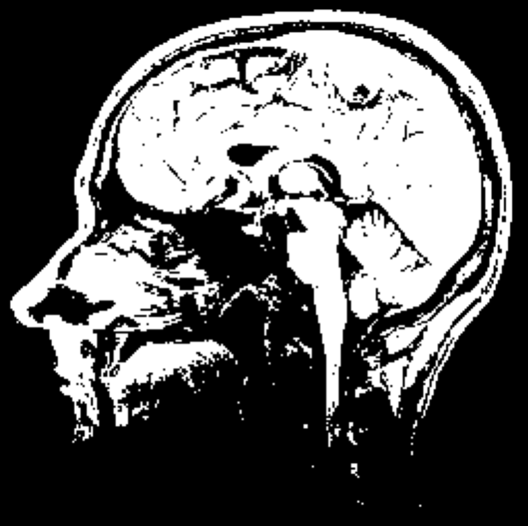

### Masking MRI Data

To begin, again, we will need to import packages necessary to work with this data...


```python
import imageio
import scipy.ndimage as ndi
import numpy as np
import matplotlib.pyplot as plt
```

Here is the **brain** image from [before](MRIdata.md) to remind ourselves which areas we want to mask...



The contrast in the image comes from the difference between water and fat, fat appearing brighter. We can look at the intensity of the voxels, representing different tissue types, by using ndi.histogram()...


```python
hist = ndi.histogram(brain, min=0, max=500, bins=500)
plt.plot(hist)
plt.show()
```



The large peak near 0 represents all the black, background and cerebrospinal fluid, in the image. There is a smaller peak visible between 150 and 200, representing the brighter, fatty tissue, including the brain that we want to mask.

To isolate the brain in the image, we will use np.where() with a threshold of 125. This will make values above 125 equal to 1, and below 125 equal to 0. We can then visualize the mask using plt.imshow(), again using cmap='gray' to show the image in grayscale.


```python
brain_mask = np.where(brain >= 125, 1, 0)
plt.imshow(brain_mask, cmap='gray')
plt.axis('off')
plt.show()
```



Great! Now we have a brain mask, which we can use to further investigate the image and it's properties.
